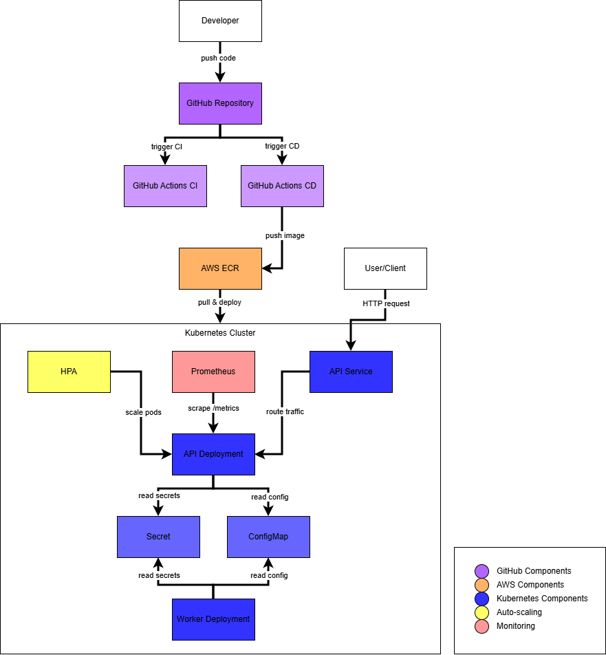

# DevOps Assignment

Production-ready DevOps setup focusing on reliability, security, CI/CD, and observability.

## Architecture Overview



**Components:**
- **API Service** (2-5 replicas) — REST API with `/health` and `/metrics`
- **Worker Service** (1 replica) — Background job, updates timestamps every 60s
- **HPA** — Auto-scales API pods when CPU > 70%
- **Prometheus** — Scrapes metrics, evaluates alert rules

## Tech Stack

| Component | Technology |
|---|---|
| Container | Docker (multi-stage builds) |
| Orchestration | Kubernetes (Docker Desktop / EKS) |
| CI/CD | GitHub Actions |
| Monitoring | Prometheus + structured JSON logs |
| Registry | AWS ECR |
| Language | Python (Flask + background worker) |

## Project Structure

```
devops-assignment/
├── api/                    # Flask API service
│   ├── app.py
│   ├── Dockerfile
│   └── requirements.txt
├── worker/                 # Background worker service
│   ├── worker.py
│   ├── Dockerfile
│   └── requirements.txt
├── k8s/
│   ├── base/               # Base K8s manifests
│   │   ├── namespace.yaml
│   │   ├── configmap.yaml
│   │   ├── secret.yaml
│   │   ├── api-deployment.yaml
│   │   ├── api-service.yaml
│   │   ├── api-hpa.yaml
│   │   └── worker-deployment.yaml
│   └── overlays/           # Environment-specific configs
│       ├── dev/
│       ├── uat/
│       └── prod/
├── monitoring/
│   ├── prometheus/
│   │   └── prometheus.yml
│   └── alerts/
│       └── alerts.yml
└── .github/
    └── workflows/
        ├── ci.yml
        └── cd.yml
```

## Setup Instructions

### Prerequisites
- Docker Desktop with Kubernetes enabled
- kubectl
- AWS CLI (for ECR)

### Local Development

```bash
# Clone repo
git clone https://github.com/anurinth-w/devops-assignment.git
cd devops-assignment

# Run API locally
docker run --rm -p 8000:8000 \
  -e OCR_API_KEY=testkey \
  -e AWS_REGION=ap-southeast-1 \
  -e OCR_S3_BUCKET=test \
  -e OCR_SQS_URL=test \
  -e OCR_DDB_TABLE=test \
  devops-api:test

# Run Worker locally
docker run --rm \
  -e WORKER_INTERVAL_SECONDS=10 \
  devops-worker:test
```

### Deploy to Kubernetes

```bash
# Deploy to dev
kubectl apply -k k8s/overlays/dev/

# Deploy to uat
kubectl apply -k k8s/overlays/uat/

# Deploy to prod
kubectl apply -k k8s/overlays/prod/

# Check status
kubectl get all -n devops-assignment
```

### Environment Variables

| Variable | Description | Required |
|---|---|---|
| `OCR_API_KEY` | API authentication key | Yes |
| `OCR_S3_BUCKET` | S3 bucket for file storage | Yes |
| `OCR_SQS_URL` | SQS queue URL | Yes |
| `OCR_DDB_TABLE` | DynamoDB table name | Yes |
| `AWS_REGION` | AWS region | Yes |
| `WORKER_INTERVAL_SECONDS` | Worker run interval (default: 60) | No |

## Usage Instructions

### API Endpoints

```bash
# Health check
curl http://localhost:8000/health

# Prometheus metrics
curl http://localhost:8000/metrics

# Create job (requires API key)
curl -X POST http://localhost:8000/jobs \
  -H "x-api-key: your-api-key" \
  -F "file=@document.pdf"

# Get job status
curl http://localhost:8000/jobs/<job_id> \
  -H "x-api-key: your-api-key"
```

### Port Forward (local K8s)

```bash
kubectl port-forward svc/api 8000:80 -n devops-assignment
```

## CI/CD Pipeline

### CI (on push/PR to main)

| Job | Description | Status |
|---|---|---|
| `python` | Install dependencies, compile Python files | ✅ Implemented |
| `docker` | Build API and Worker images | ✅ Implemented |
| `security-scan` | Scan images with Trivy (HIGH/CRITICAL) | ✅ Implemented |
| `validate-k8s` | Validate K8s manifests with kubeval | ✅ Implemented |

> Kubernetes manifests are validated using kubeval instead of applying to a live cluster.
> kubeval validates schema without requiring a running cluster, making it CI-friendly.

### CD (on push to main)

| Job | Description | Status |
|---|---|---|
| `build-and-push` | Build images, push to AWS ECR | ✅ Implemented |
| `deploy` | Deploy to EKS | 🚧 Designed (disabled) |

> The EKS deployment step is included but disabled (`if: false`) since no real EKS cluster
> is provisioned for this assignment. The step is ready for activation by removing `if: false`
> and configuring the `EKS_CLUSTER_NAME` secret.

### Required GitHub Secrets

| Secret | Description |
|---|---|
| `AWS_GITHUB_ACTIONS_ROLE_ARN` | IAM Role ARN for OIDC authentication |
| `EKS_CLUSTER_NAME` | EKS cluster name (for deploy step) |

## Failure Scenarios

### 1. API crashes during peak hours
- K8s restarts pod automatically via liveness probe
- HPA scales up replicas when CPU > 70%
- Readiness probe prevents traffic to unhealthy pods
- Alert: `HighErrorRate` triggers if error rate > 10% for 2 minutes

### 2. Worker fails and infinitely retries
- Liveness probe detects stalled worker and restarts pod
- K8s `restartPolicy: Always` ensures worker comes back
- Alert: `WorkerCrashLooping` triggers after repeated restarts
- Fix: `kubectl logs -n devops-assignment deployment/worker`

### 3. Bad deployment is released
- Roll back: `kubectl rollout undo deployment/api -n devops-assignment`
- Check status: `kubectl rollout status deployment/api -n devops-assignment`
- CI pipeline catches issues early via build + validate steps

### 4. Kubernetes node goes down
- API: min 2 replicas, pods reschedule to healthy nodes automatically
- Worker: reschedules to healthy node, resumes from next interval
- Note: Single-node (Docker Desktop) cannot reschedule — production should use multi-node EKS

## Monitoring

### ✅ Implemented

**Structured Logs** — Both API and Worker output structured JSON logs:

```json
{
  "event": "timestamp_update_done",
  "ts": 1775755543562,
  "worker_id": "worker-54b7c8f998-dwn64",
  "today": "2026-04-09",
  "updated_count": 6,
  "skipped_count": 4
}
```

**Metrics endpoint** — API exposes `/metrics` via `prometheus-flask-exporter`:

| Metric | Description |
|---|---|
| `flask_http_request_total` | Request count by method and status code |
| `flask_http_request_duration_seconds` | Request latency histogram |
| `app_info` | Service version info |

Tested locally:
```bash
curl http://localhost:8000/metrics
# flask_http_request_total{method="GET",status="401"} 1.0
```

### 🚧 Designed (Not executed)

**Prometheus scraping** — Config available at `monitoring/prometheus/prometheus.yml`.
Requires Prometheus deployment in cluster to activate. Ready for integration.

**Alert rules** — Defined in `monitoring/alerts/alerts.yml`:

| Alert | Condition | Severity |
|---|---|---|
| `HighErrorRate` | Error rate > 10% for 2m | Critical |
| `APIDown` | API unreachable for 1m | Critical |
| `WorkerCrashLooping` | Worker restarts repeatedly | Warning |

Requires Prometheus deployment to load and evaluate rules.

## Security

### ✅ Implemented

- **Non-root container** — Both API and Worker run as `appuser` (non-root)
- **Multi-stage builds** — Build tools excluded from runtime image
- **Secret separation** — Sensitive config stored in K8s Secret, not ConfigMap
- **OIDC authentication** — GitHub Actions uses IAM Role via OIDC, no static credentials
- **Trivy security scan** — CI scans images for HIGH/CRITICAL vulnerabilities

**Trivy scan results (API image):**
- CRITICAL: 0
- HIGH: 11 (all from base image `python:3.11-slim` and indirect dependencies, not application code)

## Assumptions & Decisions

| Decision | Reasoning |
|---|---|
| Docker Desktop K8s for local | Free, fast setup, manifests work on EKS with context switch |
| Kubeadm over kind | Simpler setup, no extra dependencies |
| Worker uses in-memory store | Assignment allows stubbed logic, avoids AWS dependency for local dev |
| Worker as Deployment not CronJob | Assignment specifies "background service worker" implying long-running |
| ClusterIP for API Service | API accessed via port-forward or ingress, not directly exposed |
| HPA min=2 for API | Ensures HA, single pod = single point of failure |
| kubeval over kubectl dry-run | dry-run requires live cluster, kubeval validates schema without cluster |
| Prometheus over CloudWatch | K8s ecosystem standard, cloud-agnostic, open source |
| Trivy exit-code=0 | Vulnerabilities are in base image outside our control, blocking CI would be counterproductive |
| Push directly to main | Single developer, time-constrained assignment. Production should use feature branches + PR review |
